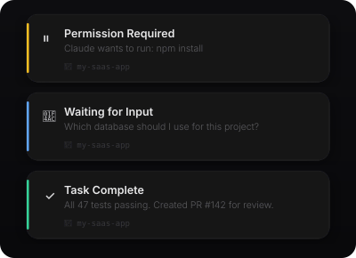

# cc-beacon

Floating HUD notifications for [Claude Code](https://docs.anthropic.com/en/docs/claude-code) on macOS. No dock icon, no Notification Center — just a borderless overlay.

<p align="center">
  
</p>

## Install

```bash
curl -sL https://raw.githubusercontent.com/4bdullatif/cc-beacon/main/install.sh | bash
```

Or build from source (`xcode-select --install` required):

```bash
git clone https://github.com/4bdullatif/cc-beacon.git
cd cc-beacon
make setup
```

## Events

| Hook event | HUD | Source |
|---|---|---|
| `permission_prompt` | 🟡 Permission Required | `message` field |
| `idle_prompt` | 🔵 Waiting for Input | `message` field |
| `Stop` | 🟢 Task Complete | last assistant message from transcript |
| `SubagentStop` | 🟢 Subagent Done | last assistant message from transcript |

Project name comes from `cwd`. Everything is auto-detected from hook JSON.

## Config

`~/.config/ccbeacon.conf`

```json
{
  "theme": "dark",
  "duration": 4,
  "sounds": {
    "permission": "Submarine",
    "feedback": "Pop",
    "done": "Glass",
    "info": null
  }
}
```

`theme` — `"dark"` or `"light"` (default: dark)
`duration` — seconds before auto-dismiss
`sounds.*` — macOS system sound name, or `null` for silent

Sounds: Glass, Submarine, Pop, Purr, Frog, Ping, Tink, Basso, Blow, Bottle, Funk, Hero, Morse, Sosumi

## CLI

```
cc-beacon [OPTIONS]

  -t, --type <TYPE>       permission | feedback | done | info
  -T, --title <TITLE>     override title
  -m, --message <MSG>     override message
  -d, --duration <SECS>   auto-dismiss seconds (default: 4)
  -s, --sound <NAME>      macOS sound name
  -h, --help
```

CLI flags > config > defaults.

## Hooks

The installer writes these to `~/.claude/settings.json`:

```json
{
  "hooks": {
    "Notification": [
      { "matcher": "permission_prompt", "hooks": [{ "type": "command", "command": "~/.local/bin/cc-beacon" }] },
      { "matcher": "idle_prompt", "hooks": [{ "type": "command", "command": "~/.local/bin/cc-beacon" }] }
    ],
    "Stop": [
      { "matcher": "", "hooks": [{ "type": "command", "command": "~/.local/bin/cc-beacon" }] }
    ],
    "SubagentStop": [
      { "matcher": "", "hooks": [{ "type": "command", "command": "~/.local/bin/cc-beacon" }] }
    ]
  }
}
```

## Known issue

[Notification hooks don't fire in the VSCode extension](https://github.com/anthropics/claude-code/issues/16114) — terminal CLI only.

## Uninstall

```bash
rm -f ~/.local/bin/cc-beacon ~/.config/ccbeacon.conf
# remove hooks from ~/.claude/settings.json
```

## License

MIT
